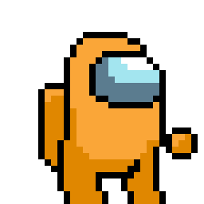
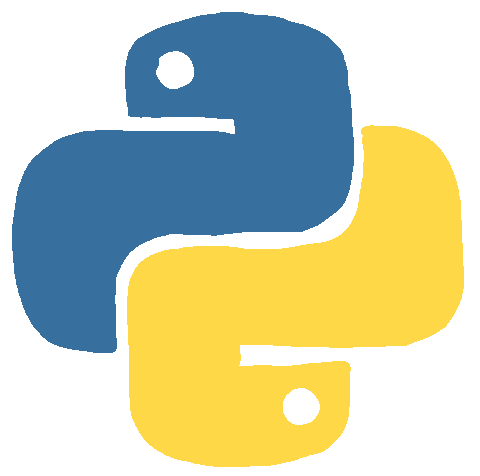

<!--
**Codelicious100/Codelicious100** is a ✨ _special_ ✨ repository because its `README.md` (this file) appears on your GitHub profile.

Here are some ideas to get you started: inte

- 🔭 I’m currently working on ...
- 🌱 I’m currently learning ...
- 👯 I’m looking to collaborate on ...
- 🤔 I’m looking for help with ...
- 💬 Ask me about ...
- 📫 How to reach me: ...
- 😄 Pronouns: ...
- ⚡ Fun fact: ...
-->
<h1 align="center">
    
</h1>

- 🌱 I’m currently learning prompt engineering 
- 🔭 I’m looking to collaborate on an SaaS project!
- 💬 Don't hesitate to give me a business proposal :)
- 📫 How to reach me: codelicious.yt@gmail.com

<h3 align="center">Language</h3>

Life is short (You need Python). Bruce Eckel

 
    
    

<picture>
  <source media="(prefers-color-scheme: dark)" srcset="https://github.com/Codelicious100/snake_game/blob/output/github-snake-dark.svg" />
  <source media="(prefers-color-scheme: light)" srcset="https://github.com/Codelicious100/snake_game/blob/output/github-snake.svg" />
  
</picture>
